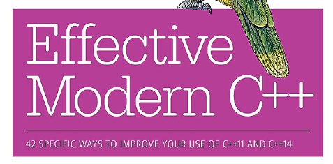

# 1. book

# 1.1 [EffectiveModernCppChinese](https://github.com/CnTransGroup/EffectiveModernCppChinese)

《Effective Modern C++》- 中文翻译

# 1.2 [CppCoreGuidelines](https://github.com/isocpp/CppCoreGuidelines)

cpp之父写的cpp教程

## 1.3 [modern-cpp-tutorial](https://github.com/changkun/modern-cpp-tutorial)

📚 Modern C++ Tutorial: C++11/14/17/20 On the Fly | https://changkun.de/modern-cpp/

## 1.4 [CPlusPlusThings](https://github.com/Light-City/CPlusPlusThings)

C++那些事

# 2. project

## 2.1 [folly](https://github.com/facebook/folly)

Folly (acronymed loosely after Facebook Open Source Library) is a library of C++14 components designed with practicality and efficiency in mind. Folly contains a variety of core library components used extensively at Facebook.

[facebook](https://github.com/facebook)实现的一系列高性能c++库

## 2.2 [modern-cpp-features](https://github.com/AnthonyCalandra/modern-cpp-features)

A cheatsheet of modern C++ language and library features.

现代c++特性教程

## 2.3 [awesome-modern-cpp](https://github.com/rigtorp/awesome-modern-cpp)

cpp的awesome系列

## 2.4 [awesome-cpp](https://github.com/fffaraz/awesome-cpp)

A curated list of awesome C++ (or C) frameworks, libraries, resources, and shiny things. Inspired by awesome-... stuff.

## 2.5 [abseil-cpp](https://github.com/abseil/abseil-cpp)

Abseil 

C++ Common Libraries The repository contains the Abseil C++ library code. Abseil is an open-source collection of C++ code (compliant to C++14) designed to augment the C++ standard library.

## 2.6 [poco](https://github.com/pocoproject/poco)

The POCO C++ Libraries are powerful cross-platform C++ libraries for building network- and internet-based applications that run on desktop, server, mobile, IoT, and embedded systems

