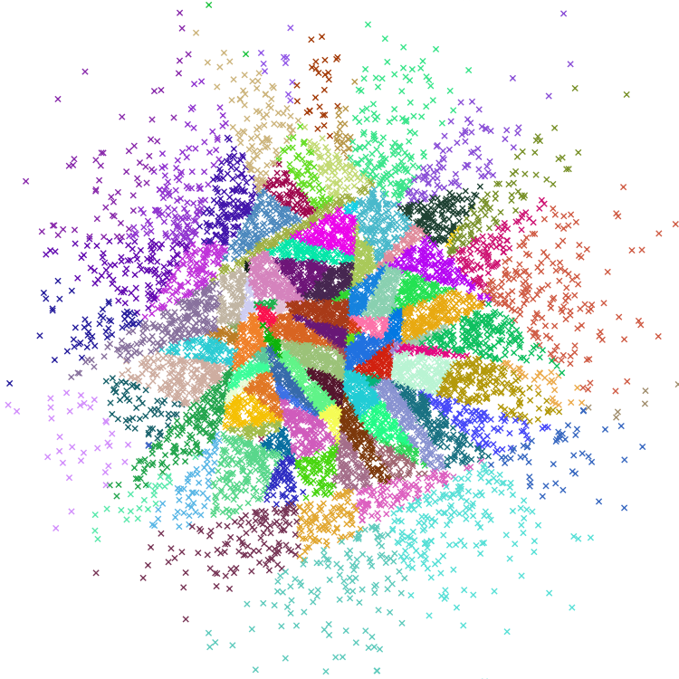

# 1 book

## 1.1 [Cookbook](https://github.com/andkret/Cookbook)
讲数据挖掘的教材

## 1.2 [Statistical-Learning-Method_Code](https://github.com/Dod-o/Statistical-Learning-Method_Code)
手写实现李航《统计学习方法》书中全部算法

## 1.3 [data-science-ipython-notebooks](https://github.com/donnemartin/data-science-ipython-notebooks)

Data science Python notebooks: Deep learning (TensorFlow, Theano, Caffe, Keras), scikit-learn, Kaggle, big data (Spark, Hadoop MapReduce, HDFS), matplotlib, pandas, NumPy, SciPy, Python essentials, AWS, and various command lines.

很多常用python科学计算库的教程

## 1.4 [numpy-cn](https://github.com/teadocs/numpy-cn)

NumPy官方中文文档（完整版）

## 1.5 [lihang-code](https://github.com/fengdu78/lihang-code)

《统计学习方法》的代码实现

## 1.6 [PythonDataScienceHandbook](https://github.com/jakevdp/PythonDataScienceHandbook)

《Python Data Science Handbook》: full text in Jupyter Notebooks

## 1.7 [pydata-notebook](https://github.com/BrambleXu/pydata-notebook)

利用Python进行数据分析 第二版 (2017) 中文翻译笔记

## 1.8 [pandas-cookbook](https://github.com/jvns/pandas-cookbook)

Recipes for using Python's pandas library

# 2 project
## 2.1 [annoy](https://github.com/spotify/annoy)
Annoy (Approximate Nearest Neighbors Oh Yeah) 
c++版本的邻近搜索  

## 2.2 [data-engineer-roadmap](https://github.com/datastacktv/data-engineer-roadmap)

Roadmap to becoming a data engineer in 2021

数据工程师的roadmap

## 2.3 [data-scientist-roadmap](https://github.com/MrMimic/data-scientist-roadmap)

Toturials coming with the "data science roadmap" picture.

数据工程师的roadmap教程

## 2.4 [dimensionality_reduction_alo_codes](https://github.com/heucoder/dimensionality_reduction_alo_codes)

特征提取/数据降维:PCA、LDA、MDS、LLE、TSNE等降维算法的python实现

## 2.5 [Virgilio](https://github.com/virgili0/Virgilio)

Your new Mentor for Data Science E-Learning.

数据科学教程

## 2.6 [pandas-tutorial](https://github.com/hangsz/pandas-tutorial)

pandas教程

适合初级到中级晋升者，有了体系之后就看熟练度了。

## 2.7 [numpy-100](https://github.com/rougier/numpy-100)

100 numpy exercises (with solutions)